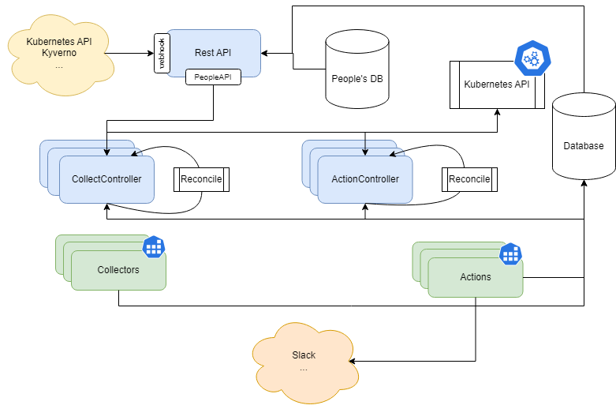

# SKA Namespace Manager

SKA Namespace Manager is a tool designed to efficiently manage namespaces in a Kuberentes cluster. The main goal is to be able to provide fair usage quotas to the multiple users of the cluster, as well as to maintain efficient use of it.

## Motivation

In a production cluster, administrators have good knowledge on what namespaces are deployed, what resources each namespace requires, and nothing gets deployed without their avail. The cluster also has a **predictable** resource usage - even when it spikes. In the case of a CICD cluster with limited resources, running jobs that are very heterogeneous in their requirements, scheduling and execution time, makes the cluster vulnerable to:

* Users/teams claiming too many resources, being CPU/Memory or simply Gitlab Runner jobs
* Stale/Failing deployments wasting resources
* Resource/Job exhaustion

Kubernetes doesn't provide an out-of-the-box solution for this, so we need a custom implementation. The goal of SKA Namespace Manager is to be able to optimize the usage of the cluster resources and provide fair share to every user. In the spirit of visibility and predictability, is expected that it communicates to the affected users any operations done to their environments. This will allow developers to be more aware of what is going on in the background.

## Design

An initial [investigation](https://confluence.skatelescope.org/display/SE/Resource+management+-+ST-2017) was done to propose a design for the namespace manager. The manager requires some components:

* Database: Keep historical records as Kubernetes (etcd) only keeps data on resources that actually exist
* CollectController/ActionController: Processes that decide what information to collect and what action to take
* Collectors: Processes that decide when collect information
* Actions: Process that act upon information
* API: Allow other systems to interact with the manager and its collected data (i.e, Kyverno, Kubernetes API)

The **collector** and **action** processes will be generated by a **CollectController** and an **ActionController** which are distributed processes themselves. Both the collectors and actors - as the controllers themselves - require the follwing:

* High availability
* Operational status reporting
* Auditing
* Decoupling from specific technologies
* Efficient and non-blocking

Given these constraints, we opted for the following design:

* Database: MongoDB (DocumentDB compatible) with an API abstracting it
* API: Python-based REST API
* Controllers: Python-based (Async) with leader-election to support high-availability
* Collectors: Jobs or CronJobs
* Actions: Jobs or CronJobs

<div align="center">

</div>
</br>

## Capabilities

Currently, the SKA Namespace Manager provides the following capabilities:

- [x] Cleanup CI namespaces after their pre-defined or default TTL
- [x] Terminate failing CI namespaces
- [ ] Terminate duplicate CI namespaces (same commit or merge request)
- [x] Notify namespace owners of their namespaces' status changes

## Testing

Currently there are no unit or integration tests.

## Contribute

To contribute, simply checkout the repository:

```
git clone git@gitlab.com:ska-telescope/ska-ser-namespace-manager.git
git submodule update --init --recursive

make k8s-install-chart
```

If deployed to a the [https://gitlab.com/ska-telescope/sdi/ska-cicd-deploy-minikube](minikube cluster), you can build a local image to be deployed by doing:

```
make oci-build-all CAR_OCI_REGISTRY_HOST=localhost:5000
```

Afterwards, you can set the registry to `<local ip>:5000` where relevant in your `values.yaml`.
