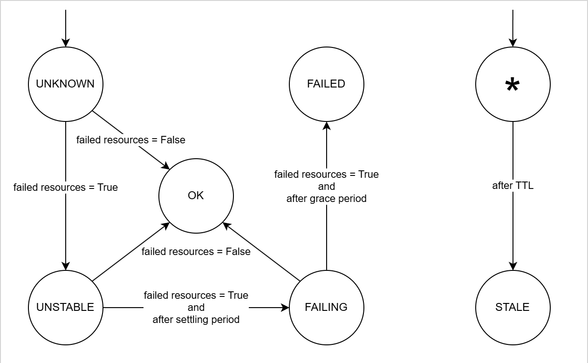

# SKA Namespace Manager

SKA Namespace Manager is a tool designed to efficiently manage namespaces in a Kuberentes cluster. The main goal is to be able to provide fair usage quotas to the multiple users of the cluster, as well as to maintain efficient use of it.

## Motivation

In a production cluster, administrators/operators have good knowledge on what namespaces are deployed, what resources each namespace requires, and nothing gets deployed surprisingly. The cluster also has a **predictable** resource usage - even when it spikes. In the case of a CICD cluster with limited resources, running jobs that are very heterogeneous in their requirements, scheduling and execution time, makes the cluster vulnerable to:

* **Resource Fairness:** Users/teams claiming too many resources, being CPU/Memory or simply Gitlab Runner jobs
* **Resource Waste:** Stale/Failing deployments wasting resources
* **Resource Scarcity:** Resource/Job exhaustion

Kubernetes doesn't provide an out-of-the-box solution for these challenges, so a custom implementation is provided here. The goal of SKA Namespace Manager is to be able to optimize the usage of the cluster resources and provide fair share to every user. In the spirit of visibility and predictability, it is expected that it communicates to the affected users any operations done to their environments. This will allow developers to be more aware of what is going on in the background for their CI/CD.

In the spirit of visibility and predictability, SKA Namespace Manager now integrates with Prometheus alerts to dynamically monitor namespaces and react to failures proactively. This ensures that affected users are notified of critical namespace issues before they escalate.

## Design

An initial [investigation](https://confluence.skatelescope.org/display/SE/Resource+management+-+ST-2017) was done to propose a design for the namespace manager. The manager requires some components:

* **Database:** Keep historical records as Kubernetes (etcd) only keeps data on resources that actually exist. This will allow detailed historical analysis 
* **CollectController/ActionController:** Processes that decide what information to collect and what action to take.
* **Collectors:** Processes that decide when collect information
* **Actions:** Process that act upon information
* **API:** Allow other systems to interact with the manager and its collected data (i.e, Kyverno, Kubernetes API)

The **collector** and **action** processes will be generated by a **CollectController** and an **ActionController** which are distributed processes themselves. Both the collectors and actors - as the controllers themselves - require the following:

* High availability
* Operational status reporting
* Auditing
* Decoupling from specific technologies
* Efficient and non-blocking

Given these constraints, we opted for the following design:

* Database: MongoDB (DocumentDB compatible) with an API abstracting it
* API: Python-based REST API
* Controllers: Python-based (Async) with leader-election to support high-availability
* Collectors: Jobs or CronJobs
* Actions: Jobs or CronJobs

<div align="center">

</div>
</br>

**Enhancements in Namespace Status Handling**

With the integration of Prometheus alerts, namespace statuses are now determined more dynamically. The following changes have been introduced:

**Prometheus Alert Integration:**
* Namespace statuses are now updated based on alerts fetched from Prometheus.
* Alerts are parsed and their related resources (pods, deployments, containers, etc) are included in the FAILED_RESOURCES annotation for further processing.

**Improved Namespace State Transitions:**
* Previously, once a namespace was marked OK, it could not transition to UNSTABLE or FAILED, even if new alerts were detected.
* Now, namespaces can transition from OK → UNSTABLE → FAILED as alerts evolve.

**Kubernetes API Fallback:**
* If Prometheus alert fetching fails, a fallback mechanism checks Kubernetes resources (Deployments, StatefulSets, ReplicaSets) for failures.

**Enhanced Annotations Management:**
* A detailed JSON annotation (FAILED_RESOURCES) is added to namespaces, containing every alert and the affected resources.

## Capabilities

Currently, the SKA Namespace Manager provides the following capabilities:

- [x] Cleanup CI namespaces after their pre-defined or default TTL
- [x] Terminate failing CI namespaces
- [ ] Terminate duplicate CI namespaces (same commit or merge request)
- [x] Notify namespace owners of their namespaces' status changes with detailed info regarding the resources affected

#### Namespace Status
There are two parallel processes checking for `Failure` and `Staleness` of namespaces.
Notification os status change happen when reaching the `FAILING`, `FAILED` and `STALE` statuses.
Once a namespace's status is set to `FAILED` or `STALE` it is deleted by a periodic task.
The status changes follow the state diagram:
<div align="center">

</div>
</br>


## Contribute

To contribute, simply checkout the repository:

```
git clone git@gitlab.com:ska-telescope/ska-ser-namespace-manager.git
git submodule update --init --recursive

make k8s-install-chart
```

If deployed to a the [https://gitlab.com/ska-telescope/sdi/ska-cicd-deploy-minikube](minikube cluster), you can build a local image to be deployed by doing:

```
make oci-build-all CAR_OCI_REGISTRY_HOST=localhost:5000
```

Afterwards, you can set the registry to `<local ip>:5000` where relevant in your `values.yaml`.

You will need to populate secrets locally, to do that create a `local.yml` file inside `charts/ska-ser-namespace-manager/environments` with the followin template:

```
image:
  repository: registry.gitlab.com/ska-telescope/ska-ser-namespace-manager/ska-ser-namespace-manager
  pullPolicy: IfNotPresent
  tag: 0.0.2-dev.c8c7da315

api:
  pki:
    createSelfSignedCert: true
  config:
    people_database:
      spreadsheet_id: 1WekvYFWkPRiWoB2yzp1BrMRwwu0fRqf20d7XbqO6OJg
      spreadsheet_range: "System Team API!A2:Z1001"
      credentials: <base64 decoded value of "people_database_credentials" in https://vault.skao.int/ui/vault/secrets/local/kv/dev%2Fska-ser-namespace-manager/details?version=1>

collectController:
  config:
    namespaces:
      - names:
          - ci-*
        ttl: 2m

actionController:
  config:
    namespaces:
      - names:
          - ci-*
```

To populate the variables inside `api.config.people_database.credentials` you need to access `secrets/local/dev/ska-ser-namespace-manager` and pull the secret named `people_database_credentials` which is base64 encoded. To deploy with the local environment variables you should use:

```
make k8s-install-chart ENVIRONMENT=local
```