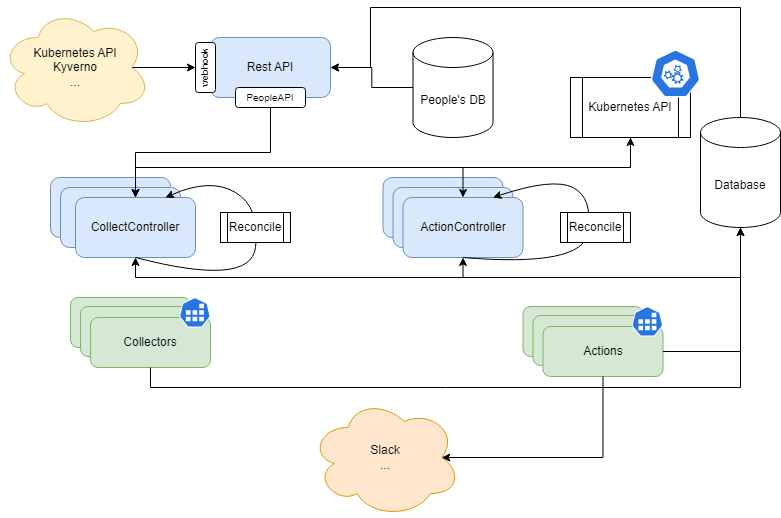

Design Overview
===============
An initial `investigation <https://confluence.skatelescope.org/display/SE/Resource+management+-+ST-2017>`_ was done to propose a design for the namespace manager. The manager requires some components:

* Database: Keep historical records as Kubernetes (etcd) only keeps data on resources that actually exist
* CollectController/ActionController: Processes that decide what information to collect and what action to take
* Collectors: Processes that decide when to collect information
* Actions: Processes that act upon information
* API: Allow other systems to interact with the manager and its collected data (i.e, Kyverno, Kubernetes API)

The ``CollectController`` and ``ActionController`` are distributed processes and require the following:

* High availability
* Operational status reporting
* Auditing
* Decoupling from specific technologies
* Efficient and non-blocking

Given these constraints, we opted for the following design:

* Database: MongoDB (DocumentDB compatible) with an API abstracting it
* API: Python-based REST API
* Controllers: Python-based services with leader-election where singleton behavior is required
* Collection: In-process work executed by sharded collect-controller replicas
* Actions: In-process work executed by the leader action-controller replica

